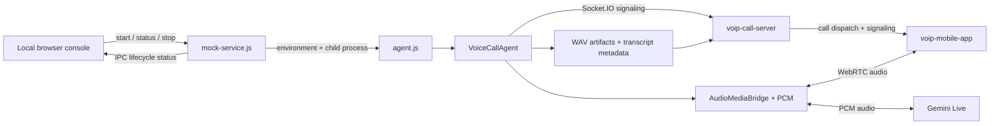

# Gemini Live Agent Architecture

## Responsibility

This project owns the server-side voice agent: simulated call initiation, Gemini Live session lifecycle, WebRTC audio bridging, transcript handling, and private per-speaker WAV artifacts. It does not own mobile UI or number routing; the call server selects the mobile endpoint.

## Layers

| Layer | Location | Responsibility |
| --- | --- | --- |
| Local control plane | `mock-service.js` | Serves the local console, validates start/stop requests, starts the agent child process, and exposes its status. It binds to `127.0.0.1:4200`; it is not the call server. |
| Operator console | `call-console.html` | Selects local or Vercel call-server mode, simulated number, and reject/queue policy; renders structured agent status and recent process logs. It never receives provider keys. |
| Process entry point | `agent.js` | Loads server-side configuration, fetches ICE settings, and constructs the agent, Gemini adapter, WebRTC runtime, and artifact clients. |
| Call orchestration | `voiceCallAgent.js` | Registers as an agent, places the call, negotiates WebRTC after acceptance, starts Gemini after media connects, gates phone audio until the greeting finishes, and coordinates cleanup. It emits lifecycle phases to the console process over IPC. |
| Gemini provider adapter | `geminiLiveSession.js` | Wraps the Google GenAI Live API session, greeting prompt, PCM input, audio/transcript event normalization, interruption handling, and session close. |
| Media and PCM | `audioMediaBridge.js`, `audioPcm.js` | Connects the remote phone track to Gemini input, converts sample formats/rates, sends generated audio back over a WebRTC track, and forwards normalized audio to artifact storage. |
| Persistence adapters | `audioArtifactStore.js`, `callArtifactClient.js` | Writes per-speaker WAV files locally and sends transcript entries plus audio metadata to protected call-server endpoints. |

## Call flow

1. The operator opens `http://127.0.0.1:4200` and starts a call. Local mode discovers the PC's LAN IPv4 address; Vercel mode uses the configured production URL.
2. The console posts the selected mode, simulated number, and availability policy to its local control API. `mock-service.js` validates the input and launches `agent.js` with those values in the child environment.
3. `agent.js` registers the child as an `agent` with the call server. The server routes the number to an available phone or queues/rejects it.
4. After the phone accepts, `VoiceCallAgent` establishes the WebRTC connection. Once media connects, it opens Gemini Live and plays Gemini's Tunisian Derja introduction first.
5. After the introduction audio drains, the mobile microphone stream is enabled for Gemini. Gemini responses travel back through the WebRTC audio track to the mobile app.
6. Input/output transcript events are posted to the call server. Mobile and agent PCM audio is written as separate WAV files under `recordings/<call-id>/`; only private artifact metadata is sent to the call server.
7. On hang-up, rejection, provider failure, or stop, the orchestrator closes Gemini, WebRTC, artifact streams, and its Socket.IO connection.

## Configuration and trust boundaries

- `GEMINI_API_KEY` and `INTERNAL_AGENT_TOKEN` stay in the agent process environment loaded from `.env`; neither is returned by the control API or embedded in the page.
- The console control server binds to loopback and rejects API requests with foreign browser origins. It is an operator tool, not a public API.
- `RINGIO_LAN_IP` optionally overrides automatic local LAN-interface selection when the host uses a VPN or multiple adapters.
- Destination numbers are simulation data only; no SIM/PSTN call is made.
- Vercel mode can validate public signaling but is not the recommended always-on runtime for long conversations. Use persistent services and TURN for reliable cross-network media.

## Entry points and checks

- Console: `npm start`, then open `http://127.0.0.1:4200`.
- Headless local agent: `npm run start:agent:local`.
- Headless Vercel agent: `npm run start:agent:vercel`.
- Tests: `npm test`; fake-provider coverage keeps the lifecycle and audio path testable without a live Gemini session.
- Related boundaries: [call server](../voip-call-server/ARCHITECTURE.md) and [mobile app](../voip-mobile-app/ARCHITECTURE.md).
